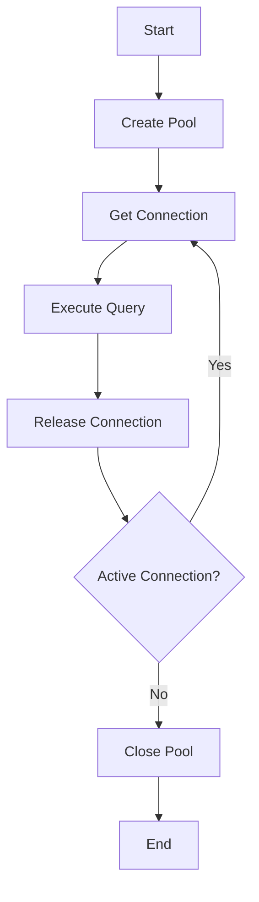

# Database Connection Restructuring Specification

## Problem Statement

Intermittent database connection failures causing inconsistent data retrieval and dashboard loading issues in Next.js application.

## Goals

1. Eliminate random connection failures
2. Implement reliable connection pooling
3. Provide consistent error handling
4. Follow Next.js best practices

## Requirements

1. Handle concurrent database requests without failures
2. Automatic connection recovery
3. Proper idle connection cleanup
4. Clear error messaging
5. Stay within Aiven connection limits

## Design Overview

### Components

1. Singleton Database Client
2. Connection Pool Manager
3. Health Monitoring System
4. Error Handling Layer

### Data Flow

1. Application requests database access
2. Pool manager provides connection
3. Client executes query
4. Results returned to application
5. Connection returned to pool

## Implementation Details

### Pool Configuration

```javascript
// Local development
const devPool = {
  max: 5,
  min: 1,
  acquire: 10000,
  idle: 2000,
};

// Production
const prodPool = {
  max: 10,
  min: 2,
  acquire: 30000,
  idle: 5000,
  // Enable keep-alive
  keepAlive: true,
  // Connection retry settings
  retry: {
    attempts: 3,
    delay: 500,
  },
};

// pgpool middleware
app.use(
  pgPool({
    pool: process.env.NODE_ENV === "production" ? prodPool : devPool,
    // Authentication handling
    auth: {
      checkToken: true,
      validateToken: validateAuthToken,
      refreshInterval: 30000,
    },
  }),
);
```

### Connection Lifecycle



### Database Client

```typescript
class DatabaseClient {
  private static instance: PrismaClient;

  private constructor() {
    // Ensure server-side execution
    if (typeof window !== "undefined") {
      throw new Error("PrismaClient cannot run in browser environment");
    }

    this.instance = new PrismaClient({
      // Configuration
    });
  }

  static getInstance(): PrismaClient {
    if (!DatabaseClient.instance) {
      DatabaseClient.instance = new DatabaseClient();
    }
    return DatabaseClient.instance;
  }
}

// Usage example
let dbClient;
if (typeof window === "undefined") {
  dbClient = DatabaseClient.getInstance();
} else {
  // Implement browser-side fallback
  dbClient = {
    query: () =>
      Promise.reject(new Error("Database access not available in browser")),
  };
}
```

### Error Handling

```typescript
interface DatabaseError {
  code: string;
  message: string;
  originalError?: Error;
}

function handleDatabaseError(error: Error): DatabaseError {
  // Error handling logic
}
```

## Testing Plan

1. Unit tests for database queries
2. Integration tests for connection handling
3. Load testing with concurrent requests
4. Monitoring dashboards

## Rollout Strategy

1. Implement in staging environment
2. Monitor for 48 hours
3. Deploy to production
4. Continuous monitoring

## Maintenance Plan

1. Weekly connection audits
2. Monthly performance reviews
3. Quarterly schema optimizations
4. Annual architecture review
